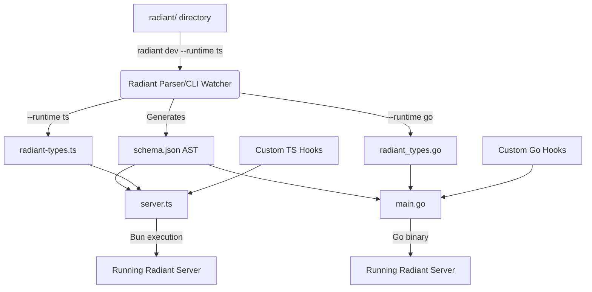

# The `.radiant` Lifecycle

Here is the step-by-step lifecycle of how a `.radiant` DSL file turns into a running, type-safe TypeScript backend.

## 1. The Developer Writes the Schema
To keep large projects organized, the developer authors their database schema inside a dedicated `radiant/` folder at the root of their project. They can split their schema into as many `.radiant` files as they want. 

This completely solves the "giant monolithic schema file" problem.

```typescript
// radiant/config.radiant

config {
  apiPrefix: "/api"
}

security {
  auth: {
    strategies: ["jwt"],
    jwt: {
      accessTokenExpiry: "15m",
      refreshTokenExpiry: "7d"
    }
  }
}

monitoring {
  healthCheck: {
    enabled: true,
    path: "/health"
  }
}
```

```typescript
// radiant/users.collection.radiant

collection users {
  auth: true;

  // Real-time Capabilities
  realtime: {
    ws: true;            // Opens native WebSockets at /api/users/ws
    sse: true;           // Server-Sent Events feed
    durableStream: true; // Reliable Redis/Postgres stream log
  }

  // Explicitly grouping the database columns
  fields: {
    name: string;
    email: email @unique;
    password: password;
    role: ["admin", "user"] @default("user");
    devices: [{ name: string, ip: string }];

    // One-to-Many Relationship
    posts: link("posts")[]; 
  }
}
```

```typescript
// radiant/globals.radiant

// Globals are singleton configuration documents (e.g. Site Settings).
global website {
  // Access control and other settings
  auth: true;

  // Fields are required just like collections
  fields: {
    heroTitle: text;
    maintenanceMode: boolean @default(false);
  }
}
```

```typescript
// radiant/posts.collection.radiant

collection posts {
  // Performance Caching
  cache: {
    ttl: "1h";
    strategy: "stale-while-revalidate";
  }
  
  fields: {
    title: string;
    body: text;
    
    // Belongs to one user
    author: link("users"); 
  }
}
```

```typescript
// radiant/employees.collection.radiant

// A collection demonstrating Self-Relationships
collection employees {
  fields: {
    name: string;
    
    // A single self-relation (Manager)
    manager: link("employees") @optional;
    
    // A many self-relation (Direct Reports)
    directReports: link("employees")[]; 
  }
}
```

## 2. The Developer Runs `radiant dev --runtime ts`
The developer runs our CLI watcher in development mode and specifies the language they want to generate types for (`ts`, `go`, or `python`). 
Behind the scenes, the CLI does three things instantly and continues to watch for changes:

### A. It Generates the Universal AST (`schema.json`)
The parser reads all `.radiant` files in the `/radiant` directory, merges them, and converts them into a rigid, structured JSON format. This JSON is the single source of truth that the backend engine understands.

```json
{
  "apiPrefix": "/api",
  "collections": [
    {
      "slug": "users",
      "auth": true,
      "fields": [
        { "name": "name", "type": "text" },
        { "name": "email", "type": "email", "unique": true },
        { "name": "password", "type": "password" }
      ]
    }
  ]
}
```

### B. It Generates the Types for Your Runtime (`radiant-types.ts` or `radiant_types.go`)
The CLI reads the AST and generates the exact native types so the developer gets perfect autocomplete in their code.

If you ran `--runtime ts`:
```typescript
// radiant-types.ts (Auto-generated)

// 1. The Core Model
export interface User {
  id: string;
  name: string;
  email: string;
  // password is omitted from public types automatically
}

// 2. The Create / Update Inputs
export interface UserCreate {
  name: string;
  email: string;
  password?: string; // Required in DB, but omitted from public output
}

export type UserUpdate = Partial<UserCreate>;

// 3. Query Builder Types
export interface UserWhereInput {
  email?: { equals?: string; contains?: string };
  name?: { equals?: string };
}

// 4. Global Framework Registry
export type Collections = {
  users: User;
}
```

If you ran `--runtime go`:
```go
// radiant_types.go (Auto-generated)
package types

// 1. The Core Model
type User struct {
    ID    string `json:"id"`
    Name  string `json:"name"`
    Email string `json:"email"`
    // password is omitted
}

// 2. The Create / Update Inputs
type UserCreate struct {
    Name     string `json:"name"`
    Email    string `json:"email"`
    Password string `json:"password"`
}

type UserUpdate struct {
    Name  *string `json:"name"`
    Email *string `json:"email"`
}

// 3. Query Builder Types
type UserWhereInput struct {
    Email *StringFilter `json:"email"`
}

type StringFilter struct {
    Equals   *string
    Contains *string
}

// 4. Global Framework Registry
type Collections struct {
    Users User
}
```

## 3. The Developer Writes Their Business Logic
Now, the developer creates a standard backend file (e.g., `server.ts` or `main.go`) to boot the server. They don't redefine the schema here. They just import the AST, pass it to the Radiant engine, and attach their custom hooks and endpoints.

### In TypeScript (Bun)

```typescript
// server.ts
import { RadiantRuntime, radiantWs } from "@codesordinatestudio/radiant/bun";
import { postgres } from "@codesordinatestudio/radiant-plugin-postgres";
import schema from "./schema.json"; // The generated AST
import type { Collections } from "./radiant-types"; // The generated types

// 1. Initialize the framework using the Universal AST
const app = new RadiantRuntime<Collections>(schema, {
  db: postgres({ url: process.env.DATABASE_URL }),
  plugins: [
    radiantWs({ path: "/ws" }), // First-class native TS plugins
  ]
});

// 2. Attach TypeScript-specific access rules and hooks
app.access("users", {
  read: (ctx) => ctx.user?.role === "admin", // TS-native auth logic
  create: (ctx) => ctx.user !== null,
});

app.hooks.beforeCreate("users", async (ctx) => {
  console.log(`Creating user: ${ctx.data.email}`);
  // Type-safe! ctx.data knows it has 'email' and 'name'
});

// 3. Attach Global Hooks (Nice-to-have / Plugin System)
// Global hooks act as universal middleware across the entire runtime lifecycle
app.plugins.push({
  name: "global-logger",
  beforeRequest: async (ctx) => {
    console.log(`[Global] Incoming request to ${ctx.request.url}`);
  },
  onError: async (ctx, err) => {
    console.error(`[Global Error]`, err);
  }
});

// 4. Attach a custom endpoint
app.router.get("/custom", () => "Hello World");

// 5. Start the server!
app.start({ port: 3000 });
```

### In Go
```go
// main.go
package main

import (
    "fmt"
    "github.com/codesordinatestudio/radiant/go/runtime"
    "github.com/codesordinatestudio/radiant/go/plugins/postgres"
    "myproject/types"
)

func main() {
    // 1. Initialize the framework using the Universal AST
    app := runtime.New("schema.json", runtime.Config{
        DB: postgres.New("DATABASE_URL"),
    })

    // 2. Attach Go-specific access rules and hooks
    app.Access("users", runtime.AccessRules{
        Read: func(ctx *runtime.Context) bool {
            return ctx.User != nil && ctx.User.Role == "admin" // Go-native auth logic
        },
    })

    app.Hooks.BeforeCreate("users", func(ctx *runtime.HookContext) error {
        // Types are strictly enforced by Go!
        user := ctx.Data.(*types.User)
        fmt.Printf("Creating user: %s\n", user.Email)
        return nil
    })

    // 3. Attach a custom endpoint
    app.Router.Get("/custom", func(ctx *runtime.Context) {
        ctx.SendString("Hello World")
    })

    // 4. Start the server!
    app.Start(":3000")
}
```

## Visual Flow Summary



## 4. Extending the Runtime (Hooks vs. Plugins)

Because the `.radiant` DSL is purely declarative, you never write business logic inside it. All logic is handled in your runtime execution (`server.ts` or `main.go`). There are two ways to extend this runtime depending on your goals:

### Approach A: Standard Functions inside Hooks (Custom Business Logic)
If you just want to do something custom—like send a welcome email when a user signs up—you **do not need a plugin**. You simply import your favorite SDK (like Resend) and use it inside a standard hook.

```typescript
import { RadiantRuntime } from "@codesordinatestudio/radiant/bun";
import { Resend } from "resend";

const app = new RadiantRuntime(schema, ...);
const resend = new Resend("re_123456");

app.hooks.afterCreate("users", async (ctx) => {
  // Just standard TS! Send the email.
  await resend.emails.send({
    to: ctx.record.email,
    subject: "Welcome!"
  });
});
```

### Approach B: Global Hooks & Middleware
While collection hooks trigger on specific database events, **Global Hooks** intercept the entire engine's lifecycle. They are registered via the Plugin system and are useful for global rate-limiting, custom authentication, universal request logging, or catching unhandled errors.

```typescript
const myGlobalMiddleware = {
  name: "my-middleware",
  onInit: (app) => console.log("Server booting up!"),
  beforeRequest: async (ctx) => {
    // Intercept every single HTTP request
    if (ctx.request.headers.get("X-Ban-List")) throw new Error("Banned");
  },
  afterRequest: async (ctx, response) => {
    // Audit or modify the response globally
    response.headers.set("X-Powered-By", "Radiant");
  }
};

const app = new RadiantRuntime(schema, { plugins: [myGlobalMiddleware] });
```

### Approach C: Framework Plugins (Dependency Injection)
Plugins are only required when you want to **override core framework behavior** or distribute reusable lifecycle logic. 

For example, if your `.radiant` schema has a `file` field, the Radiant engine natively handles the file upload by saving it to the local disk using its internal `app.storage` provider. If you want those files to go to AWS S3 instead, you use a Plugin to override that Dependency Injection.

**1. The Plugin Author Writes (TypeScript):**
```typescript
import { S3Client, PutObjectCommand } from "@aws-sdk/client-s3";

// The plugin overrides the framework's StorageProvider contract
export function s3StoragePlugin(bucket: string) {
  return {
    name: "s3-storage",
    onInit: (app) => {
      const s3Client = new S3Client({ region: "us-east-1" });
      
      // MAGIC: We override the framework's default local disk provider!
      app.storage = {
        upload: async (fileStream, filename) => {
          await s3Client.send(new PutObjectCommand({ Bucket: bucket, Key: filename, Body: fileStream }));
          return `https://${bucket}.s3.amazonaws.com/${filename}`;
        }
      };
    }
  };
}
```

**2. You (The User) Register It (TypeScript):**
```typescript
import { s3StoragePlugin } from "community-s3-plugin";

const app = new RadiantRuntime(schema, {
  plugins: [
    s3StoragePlugin("my-app-uploads") // Register the plugin
  ]
});
```

---

### The Exact Same Architecture in Go
Because the architecture is universal, a Go developer building a community plugin does the exact same thing using the Go SDK:

**1. The Plugin Author Writes (Go):**
```go
package s3plugin

import (
    "bytes"
    "context"
    "github.com/aws/aws-sdk-go-v2/service/s3"
    "github.com/codesordinatestudio/radiant/go/runtime"
)

type S3Storage struct {
    client *s3.Client
    bucket string
}

func (s *S3Storage) Upload(fileStream []byte, filename string) (string, error) {
    _, err := s.client.PutObject(context.TODO(), &s3.PutObjectInput{
        Bucket: &s.bucket,
        Key:    &filename,
        Body:   bytes.NewReader(fileStream),
    })
    return "https://" + s.bucket + ".s3.amazonaws.com/" + filename, err
}

func New(bucket string) runtime.Plugin {
    return runtime.Plugin{
        Name: "s3-storage",
        OnInit: func(app *runtime.App) {
            client := s3.NewFromConfig(...)
            // MAGIC: We override the framework's default local disk provider!
            app.Storage = &S3Storage{client: client, bucket: bucket}
        },
    }
}
```

**2. You (The User) Register It (Go):**
```go
import (
    "github.com/codesordinatestudio/radiant/go/runtime"
    s3plugin "github.com/community/radiant-plugin-s3"
)

func main() {
    app := runtime.New("schema.json", runtime.Config{
        Plugins: []runtime.Plugin{
            s3plugin.New("my-app-uploads"), // Register the plugin
        },
    })
    app.Start(":3000")
}
```

Now, whenever the framework encounters a `file` upload, it blindly calls `app.storage.upload()` (in TypeScript) or `app.Storage.Upload()` (in Go), which routes it straight to S3. The `.radiant` DSL never knew about S3, and the S3 Plugin never knew about your schema. They simply communicate through the standardized language-level contract.

---

## 5. Phase 1 Implementation Guide: Building the DSL Engine (✅ COMPLETED)

Because the entire Radiant framework is dependent on the Universal AST (`schema.json`), **Phase 1 must be strictly focused on building the DSL Parser.** Without the parser, there is nothing for the runtimes to consume. 

The next AI agent picking up this task should focus exclusively on building the CLI tool that parses `.radiant` files. 

### What entails a Complete DSL Engine?

To successfully build Phase 1, four core components must be implemented:

1. **The Grammar & Lexer**
   - The engine needs to know that words like `collection`, `config`, and `fields` are reserved keywords.
   - It needs to recognize that `@` indicates a decorator, and `[]` means an array or relation.
   - **Recommended Approach:** Use a parser generator library (like **Peggy.js** or **Chevrotain** in TypeScript/Bun) to define the strict syntax rules. 

2. **The Parser (Text → Raw AST)**
   - The CLI must be able to target a `radiant/` directory, read multiple `.radiant` files, and merge their syntax trees in memory.
   - It converts the raw text into a programmable, in-memory Abstract Syntax Tree.

3. **The Compiler & Validator (Raw AST → `schema.json`)**
   - This step traverses the raw AST and performs strict validation. 
   - *Example validations:* If a collection uses `author: link("users")`, the compiler must verify that a collection named `"users"` actually exists. 
   - If validation passes, it emits the final, rigid `schema.json` file.

4. **The LSP (Language Server Protocol) Integration**
   - To provide a world-class developer experience, the DSL needs an LSP.
   - This provides VS Code with syntax highlighting, autocomplete (e.g., suggesting `"users"` when typing inside `link()`), and inline error squiggles when the Compiler catches an error.

**Goal for Phase 1:** Run `radiant build` against a `radiant/` directory and successfully generate a valid `schema.json` file based on the TS-mirroring syntax defined in this document.

---

## 6. Phase 2 Implementation Guide: Type Generation & Developer Experience

Phase 2 focuses on turning the abstract `schema.json` into a strictly-typed developer experience, while continuing to improve the tooling.

### Core Objectives for Phase 2:

1. **TypeScript Code Generation (`radiant-types.ts`)**
   - The CLI must consume the `schema.json` output from Phase 1 and generate strict TypeScript interfaces for Models, Create/Update inputs, and Query builders.
   - Example: A `collection users` with `email` and `password` should generate a `User` interface where `password` is omitted from the public type, and a `UserCreate` interface where it is required.

2. **The Dev Watcher (`radiant dev`)**
   - Implement `radiant dev` to watch the `radiant/` directory using a filesystem watcher (like `chokidar`).
   - On every save, it should instantly re-parse the AST and regenerate the TypeScript files, keeping the developer's autocomplete in sync in real-time.

3. **LSP Formatter (Prettier for `.radiant`)**
   - Enhance the Language Server Protocol (LSP) built in Phase 1 to support the `DocumentFormattingRequest`.
   - When a user saves a `.radiant` file or presses Format, the LSP will traverse the CST/AST and output perfectly indented code.

**Goal for Phase 2:** A developer can run `radiant dev --runtime ts`, modify their schema, and instantly see the generated `radiant-types.ts` update, while also having their `.radiant` files automatically formatted on save.

---

## 7. Phase 3 Implementation Guide: The Radiant TypeScript Runtime (Bun)

Phase 3 transitions out of the CLI tooling and focuses entirely on building the actual runtime engine that executes the user's business logic. This is the package that users will import into their `server.ts` file (`@codesordinatestudio/radiant/bun`).

### Core Objectives for Phase 3:

1. **The `RadiantRuntime` Class**
   - Build the core class that accepts the `schema.json` AST and a configuration object (database adapters, plugins).
   - This class is responsible for bootstrapping the internal HTTP server (using Bun's native `Bun.serve` or a lightweight router).

2. **Access Control & Hooks System**
   - Implement the `.access()` method to allow developers to securely define who can read/write to collections using the `AuthUser` context.
   - Implement the lifecycle hooks (`.hooks.beforeCreate`, `.hooks.afterCreate`, etc.) so developers can inject standard TS business logic into database operations.

3. **Database Adapter Interface**
   - Design the abstract contract for database plugins (like `@codesordinatestudio/radiant-plugin-postgres`).
   - The runtime should take generic JSON operations (e.g., `where: { name: { eq: "John" } }`) and pass them to the underlying DB plugin securely.

4. **Custom Endpoints & Routing**
   - Expose the `.router` property so developers can attach completely custom REST/HTTP endpoints that bypass the auto-generated CRUD routes.

**Goal for Phase 3:** A developer can write `server.ts`, initialize `new RadiantRuntime(schema)`, attach some access rules and hooks, and run `bun run server.ts` to boot a fully functioning, TS-native CRUD API on port 3000.
